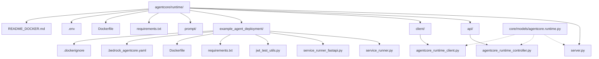

# AgentCore Runtime Service Architecture

```mermaid
classDiagram
    %% File: server.py
    class FastAPIServer {
        +app: FastAPI
        +create_agent_runtime(request: CreateAgentRuntimeRequest) CreateAgentRuntimeResponse
        +delete_agentcore_runtime(request: DeleteAgentRuntimeRequest) DeleteAgentRuntimeResponse
        +get_agentcore_runtime(agent_runtime_id: str) GetAgentRuntimeResponse
        +list_agentcore_runtimes(maxResults: int, nextToken: str) ListAgentRuntimesResponse
        +update_agentcore_runtime(request: UpdateAgentRuntimeRequest) UpdateAgentRuntimeResponse
        +health() dict
    }

    %% File: api/agentcore_runtime_controller.py
    class AgentCoreRuntimeController {
        +create_agent_runtime(request: CreateAgentRuntimeRequest)$ CreateAgentRuntimeResponse
        +delete_agentcore_runtime(request: DeleteAgentRuntimeRequest)$ DeleteAgentRuntimeResponse
        +get_agentcore_runtime(request: GetAgentRuntimeRequest)$ GetAgentRuntimeResponse
        +list_agentcore_runtimes(request: ListAgentRuntimesRequest)$ ListAgentRuntimesResponse
        +update_agentcore_runtime(request: UpdateAgentRuntimeRequest)$ UpdateAgentRuntimeResponse
    }

    %% File: client/agentcore_runtime_client.py
    class AgentCoreRuntimeClient {
        -agentcore_control_client: boto3.client
        -agentcore_data_client: boto3.client
        +create_agent_runtime(request: CreateAgentRuntimeRequest)$ CreateAgentRuntimeResponse
        +delete_agentcore_runtime(request: DeleteAgentRuntimeRequest)$ DeleteAgentRuntimeResponse
        +get_agentcore_runtime(request: GetAgentRuntimeRequest)$ GetAgentRuntimeResponse
        +invoke_agentcore_runtime(request: InvokeAgentCoreRuntimeRequest)$ InvokeAgentCoreRuntimeResponse
        +list_agentcore_runtimes(request: ListAgentRuntimesRequest)$ ListAgentRuntimesResponse
        +update_agentcore_runtime(request: UpdateAgentRuntimeRequest)$ UpdateAgentRuntimeResponse
        +wait_for_runtime_ready(agent_runtime_id: str, max_wait_time: int, poll_interval: int)$ GetAgentRuntimeResponse
        -_invoke_with_jwt(request: InvokeAgentCoreRuntimeRequest)$ InvokeAgentCoreRuntimeResponse
    }

    %% File: core/models/agentcore.runtime.py - Enums
    class AgentCoreRuntimeOperation {
        <<enumeration>>
        CREATE
        DELETE
        GET
        INVOKE
        LIST
        UPDATE
    }

    %% File: core/models/agentcore.runtime.py - Base Models
    class AgentCoreRuntimeRequest {
        +input: Dict[str, Any]
        +operation: str
    }

    class AgentCoreRuntimeResponse {
        +statusCode: int
        +result: Any
    }

    %% File: core/models/agentcore.runtime.py - Create Models
    class CreateAgentRuntimeRequest {
        +agentRoleArn: str
        +agentRuntimeName: Optional[str]
        +containerUri: Optional[str]
        +description: Optional[str]
        +environmentVariables: Optional[Dict[str, str]]
    }

    class CreateAgentRuntimeResponse {
        +agent_runtime_arn: str
        +workloadIdentityDetails: Dict[str, str]
        +agent_runtime_id: str
        +agentRuntimeVersion: str
        +status: str
        +createdAt: str
    }

    %% File: core/models/agentcore.runtime.py - Delete Models
    class DeleteAgentRuntimeRequest {
        +agent_runtime_id: str
    }

    class DeleteAgentRuntimeResponse {
        +agent_runtime_id: str
        +status: str
    }

    %% File: core/models/agentcore.runtime.py - Get Models
    class GetAgentRuntimeRequest {
        +agent_runtime_id: str
    }

    class GetAgentRuntimeResponse {
        +agent_runtime_arn: str
        +workloadIdentityDetails: Dict[str, str]
        +agentRuntimeName: str
        +agent_runtime_id: str
        +agentRuntimeVersion: str
        +createdAt: str
        +lastUpdatedAt: str
        +roleArn: str
        +agentRuntimeArtifact: Dict[str, Dict[str, str]]
        +networkConfiguration: Dict[str, str]
        +authorizerConfiguration: Optional[Dict[str, Any]]
        +protocolConfiguration: Optional[Dict[str, str]]
        +status: str
    }

    %% File: core/models/agentcore.runtime.py - Invoke Models
    class InvokeAgentCoreRuntimeRequest {
        +agent_runtime_arn: str
        +jwt: str
        +payload: Dict[str, Any]
        +accept: Optional[str]
        +baggage: Optional[str]
        +contentType: Optional[str]
        +mcpSessionId: Optional[str]
        +mcpProtocolVersion: Optional[str]
        +qualifier: Optional[str]
        +runtimeSessionId: Optional[str]
        +runtimeUserId: Optional[str]
        +traceId: Optional[str]
        +traceParent: Optional[str]
        +traceState: Optional[str]
    }

    class InvokeAgentCoreRuntimeResponse {
        +runtimeSessionId: str
        +mcpSessionId: str
        +mcpProtocolVersion: str
        +traceId: str
        +traceParent: str
        +traceState: str
        +baggage: str
        +contentType: str
        +response: Any
        +statusCode: int
    }

    %% File: core/models/agentcore.runtime.py - List Models
    class ListAgentRuntimesRequest {
        +maxResults: Optional[int]
        +nextToken: Optional[str]
    }

    class ListAgentRuntimesResponse {
        +runtimes: List[Dict[str, Any]]
        +nextToken: Optional[str]
    }

    %% File: core/models/agentcore.runtime.py - Update Models
    class UpdateAgentRuntimeRequest {
        +agent_runtime_id: str
        +agentRuntimeArtifact: Dict[str, Dict[str, str]]
        +roleArn: str
        +networkConfiguration: Dict[str, str]
        +protocolConfiguration: Dict[str, str]
        +authorizerConfiguration: Dict[str, Dict[str, Any]]
        +clientToken: Optional[str]
        +description: Optional[str]
        +environmentVariables: Optional[Dict[str, str]]
    }

    class UpdateAgentRuntimeResponse {
        +agent_runtime_arn: str
        +agent_runtime_id: str
        +workloadIdentityDetails: Dict[str, Dict[str, str]]
        +agentRuntimeVersion: str
        +createdAt: str
        +lastUpdatedAt: str
        +status: str
    }

    class AgentCoreWorkloadIdentityDetails {
        +workloadIdentityArn: str
    }

    %% Relationships - Architecture Layers
    FastAPIServer --> AgentCoreRuntimeController : delegates to
    AgentCoreRuntimeController --> AgentCoreRuntimeClient : delegates to
    
    %% Relationships - Model Usage
    FastAPIServer ..> CreateAgentRuntimeRequest : uses
    FastAPIServer ..> DeleteAgentRuntimeRequest : uses
    FastAPIServer ..> GetAgentRuntimeRequest : uses
    FastAPIServer ..> ListAgentRuntimesRequest : uses
    FastAPIServer ..> UpdateAgentRuntimeRequest : uses
    
    AgentCoreRuntimeClient ..> CreateAgentRuntimeResponse : returns
    AgentCoreRuntimeClient ..> DeleteAgentRuntimeResponse : returns
    AgentCoreRuntimeClient ..> GetAgentRuntimeResponse : returns
    AgentCoreRuntimeClient ..> InvokeAgentCoreRuntimeResponse : returns
    AgentCoreRuntimeClient ..> ListAgentRuntimesResponse : returns
    AgentCoreRuntimeClient ..> UpdateAgentRuntimeResponse : returns
    
    AgentCoreRuntimeClient ..> InvokeAgentCoreRuntimeRequest : processes
    
    %% Base model relationships
    AgentCoreRuntimeRequest ..> AgentCoreRuntimeOperation : uses
```

## File Structure Overview

## Architecture Pattern

The AgentCore Runtime service follows a **layered architecture pattern**:

1. **Presentation Layer** (`server.py`): FastAPI endpoints that handle HTTP requests
2. **Controller Layer** (`api/agentcore_runtime_controller.py`): Facade pattern with static methods
3. **Service Layer** (`client/agentcore_runtime_client.py`): Business logic and AWS API interactions
4. **Model Layer** (`core/models/agentcore.runtime.py`): Pydantic data models and enums

## Key Features

- **CRUD Operations**: Create, Read, Update, Delete AgentCore Runtime resources
- **Runtime Invocation**: Invoke agents with JWT authentication
- **Status Monitoring**: Wait for runtime readiness with polling
- **AWS Integration**: Direct boto3 client usage for Bedrock AgentCore APIs
- **Type Safety**: Comprehensive Pydantic models for all operations
